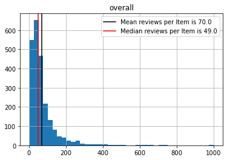
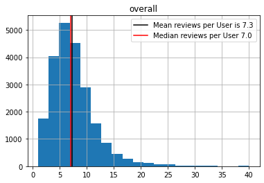

# Recommendation Tools Individual Assignment ### Fernando Delgado The following notebook describes a recommendation systems project that is part of a in-class kaggle competition of the following link: https://www.kaggle.com/c/recsys-2022/overview ## Introduction A recommender system, or a recommendation system, is a subclass of information filtering system that seeks to predict the "rating" or "preference" a user would give to an item. For this project, we put our recommendation skills to the test by applying different algorithms to the Amazon review dataset. Then we upload our solution file to Kaggle. ```python wd = "C:/Users/fdelgado/OneDrive - IESEG/Documents/01. IESEG/16. Recommendation Systems/Individual Project/" ``` ```python #Data manipulation import pandas as pd import numpy as np #Visualization import matplotlib.pyplot as plt #Recommendation Systems import surprise from surprise import Dataset from surprise import Reader from surprise import BaselineOnly from surprise import KNNBasic from surprise import accuracy from surprise import SVD from surprise import SVDpp from surprise import CoClustering from surprise.model_selection import GridSearchCV from IESEGRecSys import eval #Machine Learning import sklearn from sklearn.model_selection import train_test_split ``` ```python train = pd.read_csv(wd+'data/raw/train.csv') metadata = pd.read_csv(wd+'data/raw/metadata.csv') ``` ## Objective The objective of this project is to fit the best recommendation model for our dataset. To validate our model we want to obtain the lowest RMSE possible. AS a benchmark, we have a RMSE of 1.03 in Kaggle, meaning that anything lower than that value should be sufficient. Thus, I will fit 3 different models and compare them, in order to choose the best one in relation to their RMSE. Root Mean Square Error is the standard deviation of the prediction errors (residuals). RMSE is a measure of how spread out these residuals are. In other words, it tells us how concentrated the data is around the line of best fit. Thus, the lower the RMSE, the better. ## Data Preparation The dataset consists of 2 files: * train: user-item ratings, including review text and additional user data * metadata: additional item data (title, description, image_url) First, we inspect the train dataset: ```python train.head() ``` 
	userID	overall	asin	vote	reviewText	summary	style	image
0	13527	5.0	B0002565TI	NaN	These filters used to be sold at PetCo, but no...	Great Place to Get Filte-rs	NaN	NaN
1	14608	2.0	B0002H3ZLM	NaN	Did not work for my large- does. Returned it.	T#wo Stars	{'Size:': ' LARGE 60-130 LBS.', 'Color:': ' BL...	NaN
2	15536	5.0	B0009YD8OC	NaN	I was pretty skeptical that this would be easy...	stops pulling in a 6 month 60{ pound pup great!	NaN	NaN
3	12868	5.0	B001VPA9OK	NaN	Works great for groom-ing my dog. A must have.	Five /Stars	{'Color:': ' Silver'}	NaN
4	181	5.0	B000K67UF2	NaN	Great cage for budgies! I cant say enough marv...	Great cage for budg{ies	{'Size:': ' Medium', 'Pattern:': ' MO2 Cage'}	NaN
We can visualize how many times an item has been reviewd on average with the following histogram: ```python # average number of reviews per item reviews_item = train.groupby('asin').agg({'overall':'count'}) #histogram reviews_item.clip(upper=1000).hist(bins=40) plt.axvline(x=reviews_item.mean().item(), label=f"Mean reviews per Item is {reviews_item.mean().item():.1f}", c="k") plt.axvline(x=reviews_item.median().item(), label=f"Median reviews per Item is {reviews_item.median().item():.1f}", c="r") plt.legend() ```  Given that our items have an average number of 70 reviews, we decide to filter out all of those items that have been reviewed less than 10 times as it may bias our models. ```python # filter items with 10+ ratings ratings_count = train["asin"].value_counts() min_count = 10 items_filter = list(ratings_count[ratings_count >= min_count].index) train = train[train["asin"].isin(items_filter)].reset_index(drop=True) print(f"Removed {len(ratings_count) - (ratings_count > min_count).sum()} items") ``` Removed 85 items Moreover, we do the same visualization for ratings per user and filter out all of those users with less than 3 ratings witin the dataset. ```python # average number of items rated by users reviews_user = train.groupby('userID').agg({'overall':'count'}) #histogram reviews_user.clip(upper=40).hist(bins=20) plt.axvline(x=reviews_user.mean().item(), label=f"Mean reviews per User is {reviews_user.mean().item():.1f}", c="k") plt.axvline(x=reviews_user.median().item(), label=f"Median reviews per User {reviews_user.median().item():.1f}", c="r") plt.legend() ```  ```python # filter users with 5+ ratings ratings_count = train["userID"].value_counts() min_count = 3 users_filter = list(ratings_count[ratings_count >= min_count].index) train = train[train["userID"].isin(users_filter)].reset_index(drop=True) print(f"Removed {len(ratings_count) - (ratings_count > min_count).sum()} users") ``` Removed 3503 users Finally, in order to run our collaborative filtering models, we need a table with only 3 columns: UserID, item(asin) and rating(overall). ```python train = train[['userID', 'asin', 'overall']] train.head() ``` 
	userID	asin	overall
0	13527	B0002565TI	5.0
1	14608	B0002H3ZLM	2.0
2	15536	B0009YD8OC	5.0
3	12868	B001VPA9OK	5.0
4	181	B000K67UF2	5.0
### Train/Test Split Moving forward, before fitting any model,we split our train dataset into another train and test split, following a 70/30 ratio. Then we apply reader from surprise package in order to run our collaborative filtering models. ```python # train-test split train, test = train_test_split(train, test_size=0.3) reader = Reader(rating_scale=(1, 5)) df_train = Dataset.load_from_df(train, reader).build_full_trainset() df_test = list(test.itertuples(index=False, name=None)) ``` ## Collaborative Filtering Models Collaborative Filtering does not need the features of the items to be specified, it simply works with the user id, artist id, and the particular rating. When it creates a recommendation, it considers another user’s input to recommend another particular user. For example, if a user A has similar behavior than user B, then it is likely that the things that user A likes, will be enjoyed by user B. There are many different types of collaborative filtering methods, but for this project we will run 4: * Cosine User-based * ALS * SVD * SVD++ ### User-Based User-based collaborative filtering works by estimating a user’s rating based on a similar set of users who have a similar behavior as our target user. The simple approach would be to make an average of other similar users on given product and assign it to our prediction target. On the options we specify a cosine user-based model with a standard of 20 most similar users with a minumum of 5. ```python # set option to cosine similarity and user-based collaborative filtering options = {'name':'cosine', 'user_based':True} # select 20 most similar users (min 5) ub = KNNBasic(k=20, min_k=5, sim_options=options, random_state=42) # fit on training set ub.fit(df_train) ``` Computing the cosine similarity matrix... Done computing similarity matrix. Once the model is fitted, we evaluate our prediction on or test split and end up with our first RMSE ```python #Evaluate Test Set pred = ub.test(df_test) accuracy.rmse(pred) # percentage impossible predictions perc_impossible = np.sum([1 for i in pred if i.details["was_impossible"]]) / len(pred) print(f"Impossible: {perc_impossible:.4f}") ``` RMSE: 1.1571 Impossible: 0.5629 ```python userbased_eval = eval.evaluate(prediction=pred, topn=5, rating_cutoff=4, excl_impossible=True) #Rename column userbased_col = userbased_eval.rename(columns={"value": "cosine_userbased"}) userbased_col ``` Excluded 26743 (47511) samples. 20768 remaining ... Excluded 26743 (47511) samples. 20768 remaining ... 
	cosine_userbased
RMSE	1.123548
MAE	0.826690
Recall	0.855558
Precision	0.839475
F1	0.847440
NDCG@5	0.920382
# ALS Alternating Least Squares is a model that based on matrix factorization. It used a Weighted-Lambda-Regularization. It factors the 3 following matrices: The user to item, item to feature and user to feature matrix. The goal is to understand the factors that define the user to item ratings. It will then find an optimal factor weight to reduce to the minimum the least squares. In this example we run a simple ALS with 30 epochs: ```python options = {"method": "als", "n_epochs": 30} als = BaselineOnly(bsl_options=options) # fit on training set als.fit(df_train) pred = als.test(df_test) accuracy.rmse(pred) # percentage impossible predictions perc_impossible = np.sum([1 for i in pred if i.details["was_impossible"]]) / len(pred) print(f"Impossible: {perc_impossible:.4f}") ``` Estimating biases using als... RMSE: 1.0900 Impossible: 0.0000 ```python als_eval = eval.evaluate(prediction=pred, topn=5, rating_cutoff=4, excl_impossible=True) als_col = als_eval.rename(columns={"value": "als"}) als_col ``` Excluded 0 (47511) samples. 47511 remaining ... Excluded 0 (47511) samples. 47511 remaining ... 
	als
RMSE	1.090019
MAE	0.821239
Recall	0.895110
Precision	0.848024
F1	0.870931
NDCG@5	0.880785
# SVD Singular Value Decomposition uses dimension reduction by using matrix decomposition. The SVD’s purpose is to propose multivariate data analysis. This simplifies the data, removes noise but can also be used to improve algorithm results. In this particular model we run a standar SVD model with 20 factors: ```python # select 20 factors and use probabilistic matrix factorization (no bias) svd = SVD(n_factors=20, random_state=42) # fit on training set svd.fit(df_train) pred = svd.test(df_test) accuracy.rmse(pred) # percentage impossible predictions perc_impossible = np.sum([1 for i in pred if i.details["was_impossible"]]) / len(pred) print(f"Impossible: {perc_impossible:.4f}") ``` RMSE: 1.0829 Impossible: 0.0000 ```python svd_eval = eval.evaluate(prediction=pred, topn=5, rating_cutoff=4, excl_impossible=True) svd_col = svd_eval.rename(columns={"value": "svd"}) svd_col ``` Excluded 0 (47511) samples. 47511 remaining ... Excluded 0 (47511) samples. 47511 remaining ... 
	svd
RMSE	1.082948
MAE	0.802318
Recall	0.855912
Precision	0.858177
F1	0.857043
NDCG@5	0.880782
### SVD++ Reading into surprise's documentation, we run a small variation to SVD named SVD++ that runs slower but usually finds slightly better results than the normal SVD. The way to interpret SVD++ is that it is including the effect of the "implicit" information. By understanding that a user rates an item is in itself an indication of preference. In other words, chances that the user "likes" an item the user has rated are higher than for a random not-rated item. ```python svdpp = SVDpp(n_factors=200 , n_epochs = 150, lr_all = 0.01, reg_all = 0.1, random_state=42) # fit on training set svdpp.fit(df_train) svdpp_pred = svdpp.test(df_test) accuracy.rmse(svdpp_pred) # impossible predictions perc_impossible = np.sum([1 for i in svdpp_pred if i.details["was_impossible"]]) / len(svdpp_pred) print(f"Impossible: {perc_impossible:.4f}") ``` RMSE: 1.0649 Impossible: 0.0000 ```python svdpp_eval = eval.evaluate(prediction=pred, topn=5, rating_cutoff=4, excl_impossible=True) svdpp_col = svdpp_eval.rename(columns={"value": "svdpp"}) svdpp_col ``` Excluded 0 (47511) samples. 47511 remaining ... Excluded 0 (47511) samples. 47511 remaining ... 
	svdpp
RMSE	1.082948
MAE	0.802318
Recall	0.855912
Precision	0.858177
F1	0.857043
NDCG@5	0.880782
### Overview After running our 4 different models, we create an overview table to compare. In this case, we focus on the RMSE scores since it's our main target for the Kaggle competition. SVD and SVD++ are our best fit. They are both close to the benchmark of 1.03 but still need some work. ```python overview = pd.concat([userbased_col, svd_col, als_col, svdpp_col], axis=1) overview ``` 
	cosine_userbased	svd	als	svdpp
RMSE	1.123548	1.082948	1.090019	1.082948
MAE	0.826690	0.802318	0.821239	0.802318
Recall	0.855558	0.855912	0.895110	0.855912
Precision	0.839475	0.858177	0.848024	0.858177
F1	0.847440	0.857043	0.870931	0.857043
NDCG@5	0.920382	0.880782	0.880785	0.880782
## Param Grid to Improve RMSE On all of the methods above, we ran very standard parameters for each model but, they can be improved by assigning different parameters to each one of them to get the best possible results. In this case, we run a SVD, SVD++, and ALS parameter grid to find the best parameters. In essence, it runs the same model several times with all of the possible combinations of parameters to obtain the best fit. Depending on how many parameters we specify, it may take up to several hours to complete. ### SVD param grid Warning: this code may take up to +5 hours to run depending on how many parameters we specify: ```python #df_auto = Dataset.load_from_df(train, reader) #param_grid = {'n_factors': [50,100,200,250], # 'n_epochs':[20,100,150,250], # 'lr_all':[0.005,0.01], # 'reg_all':[0.1,0.2,0.5]} #gs = GridSearchCV(SVD, param_grid, measures=['rmse'], cv=3, refit=True) #gs.fit(df_auto) # combination of parameters with the best RMSE #print(gs.best_params['rmse']) #print(gs.best_score['rmse']) ``` {'n_factors': 250, 'n_epochs': 100, 'lr_all': 0.01, 'reg_all': 0.1} 1.0856310783822753 ### SVD++ Param Grid Note: this is commented out to be able to run the whole notebook without taking too much time ```python # df_auto = Dataset.load_from_df(train, reader) # param_grid = {'n_factors': [50,100,200,250], # 'n_epochs':[20,100,120,150,200,250], # 'lr_all':[0.005,0.01], # 'reg_all':[0.1,0.2,0.5]} # gs = GridSearchCV(SVDpp, param_grid, measures=['rmse'], cv=3, refit=True) # gs.fit(df_auto) # # combination of parameters with the best RMSE # print(gs.best_params['rmse']) # print(gs.best_score['rmse']) ``` ### ALS Param Grid ```python #als_data = Dataset.load_from_df(train, reader) #param_grid = {'bsl_options': {'n_epochs':[30,50, 70], # 'reg_u':[7, 10, 15], # 'reg_i':[10, 13, 20]}} #gs = GridSearchCV(BaselineOnly, param_grid, measures=['rmse'], cv=3) #gs.fit(als_data) #print(gs.best_params['rmse']) #print(gs.best_score['rmse']) ``` Estimating biases using als... Estimating biases using als... Estimating biases using als... Estimating biases using als... Estimating biases using als... Estimating biases using als... Estimating biases using als... Estimating biases using als... Estimating biases using als... Estimating biases using als... Estimating biases using als... Estimating biases using als... Estimating biases using als... Estimating biases using als... Estimating biases using als... Estimating biases using als... Estimating biases using als... Estimating biases using als... Estimating biases using als... Estimating biases using als... Estimating biases using als... Estimating biases using als... Estimating biases using als... Estimating biases using als... Estimating biases using als... Estimating biases using als... Estimating biases using als... Estimating biases using als... Estimating biases using als... Estimating biases using als... Estimating biases using als... Estimating biases using als... Estimating biases using als... Estimating biases using als... Estimating biases using als... Estimating biases using als... Estimating biases using als... Estimating biases using als... Estimating biases using als... Estimating biases using als... Estimating biases using als... Estimating biases using als... Estimating biases using als... Estimating biases using als... Estimating biases using als... Estimating biases using als... Estimating biases using als... Estimating biases using als... Estimating biases using als... Estimating biases using als... Estimating biases using als... Estimating biases using als... Estimating biases using als... Estimating biases using als... Estimating biases using als... Estimating biases using als... Estimating biases using als... Estimating biases using als... Estimating biases using als... Estimating biases using als... Estimating biases using als... Estimating biases using als... Estimating biases using als... Estimating biases using als... Estimating biases using als... Estimating biases using als... Estimating biases using als... Estimating biases using als... Estimating biases using als... Estimating biases using als... Estimating biases using als... Estimating biases using als... Estimating biases using als... Estimating biases using als... Estimating biases using als... Estimating biases using als... Estimating biases using als... Estimating biases using als... Estimating biases using als... Estimating biases using als... Estimating biases using als... {'bsl_options': {'n_epochs': 30, 'reg_u': 7, 'reg_i': 13}} 1.0877558778343779 ## Final Model Running parameter grid is a trial and error. Here we ran several times with different parameters while adjusting/adding/removing new parameters. Basically, we run predictions on our dataset with all of our different results for SVD, SVDpp, and ALS to upload it to Kaggle. It is tricky because we get good RMSE in the jupyter notebook but a much higher one in kaggle(or viceversa). You may never know the real result until you submit your prediction to Kaggle. Thus, we made several submissions to find the best parameters. After several runs, we find the following SVDpp model as the best one: ```python svd = SVDpp(n_factors=200 , n_epochs = 100, lr_all = 0.01, reg_all = 0.1, random_state=42) # fit on training set svd.fit(df_train) # predict svd_pred = svd.test(df_test) accuracy.rmse(svd_pred) # impossible predictions perc_impossible = np.sum([1 for i in svd_pred if i.details["was_impossible"]]) / len(svd_pred) print(f"Impossible: {perc_impossible:.4f}") ``` RMSE: 1.0656 Impossible: 0.0000 We had a RMSE of 1.0656 but in kaggle it was 1.012 (and it may still change once its fitted in the full data). ### Predict on Test set Finally, we implement our prediction on the test set and prepare to export our file: ```python #Load data test_students = pd.read_csv(wd+'data/raw/test_students.csv') #format table to export test_students = test_students[['userID','asin']] test_students['overall'] = 0 #cast to tuple test_students = test_students.to_records(index=False) ``` ```python #predict on test set result = svd.test(test_students) #Create Dataframe result = pd.DataFrame(result) #Clean Column names and format result['ID']= result['uid'].astype(str)+result['iid'].astype(str) result = result[['ID','est']] result = result.rename(columns={"est": "overall"}) result.head() ``` 
	ID	overall
0	21069B00BFK2B24	3.539585
1	3506B00ZK0Y7R2	3.816846
2	21907B0002AQPA2	3.947712
3	14092B0002DHXX2	4.544069
4	3085B0006VB3SQ	4.415539
```python #Export to csv result.to_csv(wd+'data/final/submission_14.csv', index=False) ``` ## Conclusion Running Recommendation systems for this project was a lot of trial-error. Right from the start, I decided to work with collaborative filtering because I was getting good results in comparisson with the kaggle benchmark. Thus, running param grids to improve my score was the best solution. However, it was not that easy. Param Grid can take up to 24 hours or more depending on how many parameters you are running and how large is your data. Thus, making tests and trying out different parameters took several days until i finally found the right one that improved my model. Also, i noticed that by resetting the whole notebook and re-doing the train/test split could change my scores drastically given that it is always a random split. Moreover, as further steps for this project I could run a content-based model and a hybrid model in order to compare their performance versus the collaborative filtering. 
